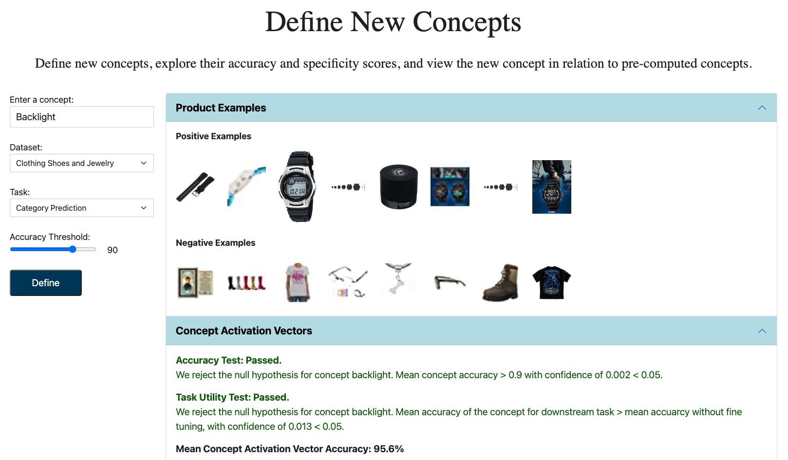

# ConceptNavigator
An implementation of Concept Navigator: Exploring and Analyzing Concepts in e-Commerce Models

## Demonstration Video
A system semonstration video is [avaliable]().

## Abstract
Explainable machine learning methods are imperative to increasing decision transparency and improving customer trust. In recent years, opaque model architectures, specifically deep neural networks, have become popular in the domain of e-commerce. In order to take advantage of the high accuracy of these models, while still enabling decision transparency, the research community has sought methods to analyze and explain their decision process.

Concept Activation Vectors (CAV) are one such method that outputs an interpretation of the decision space of a particular trained neural network model. A CAV is a linear classifier trained in the latent space of the model, that aims to separate embedding of input samples labeled as positive or negative with respect to the concept of interest. A concept in this context is a binary semantic quality of input examples, such as *cozy*, *polka dots* or *rechargeable*. Roughly speaking, if a concept is learnable in this representation then it is argued that the concept contributes to the models decision process. The CAV technique has produced impressive results in many domains. However, the definition of the concept taxonomy and the allocation of concepts to specific examples, remains an inexact and labor-intensive process in general.

 In this work we provide a solution to this problem that leverages the multi-modal nature of e-commerce product data. That is, each product is associated with (one or more) images, title, description, and structured name-value pairs. The additional modalities can be harvested to first, obtain concept candidates and later, allocate concepts to examples. Specifically, when we are interested in image models, we obtain the concepts associated with each product image from the text-based modalities of the product.

 We present **Concept Navigator**, a system for a visual semantic explanation of the decision space of deep neural models trained on e-commerce images and tasks. 
 

 

## Prepare the Enviroment 
1. Clone this repository: 
```
git clone https://github.com/danaarad/ConceptNavigator.git
```

2. Install the dependencies:
```
conda create -n concepts python=3.7
conda activate concepts
cd ConceptNavigator
pip install -r requirement.txt
```
Install Pytorch. See [Pytorch](https://pytorch.org/) for the command for your system to install correct version of Pytorch.

## Prepare the Data
Download the [Amazon products dataset](https://nijianmo.github.io/amazon/) and unzip into ConceptNavigator/<dataset>, where <dataset> is either "fashion" or "electronics". Download product images into ConceptNavigator/<dataset>/imgs

Collect n-grams:
```
python generate_ngrams.py
```

Annotate products with concepts:
```
python annotate_concepts.py
```

Split products into train/dev/test:
```
python split_products.py

```

## Train Prediction Models
Fine-tune ViT models on price prediction and category prediction tasks:

 Price Prediction:
 ```
 python train_price_prediction.py
 ```

 Category Prediction:
 ```
 python train_category_prediction.py
 ```

## Concept Activation Vectors


To generate the concept activation vectors:
 
 ```
 python concept_activation_vectors.py
 ```

For further processing of the concepts and Concept Activation Vectors, See options in process_concepts.py.


 

